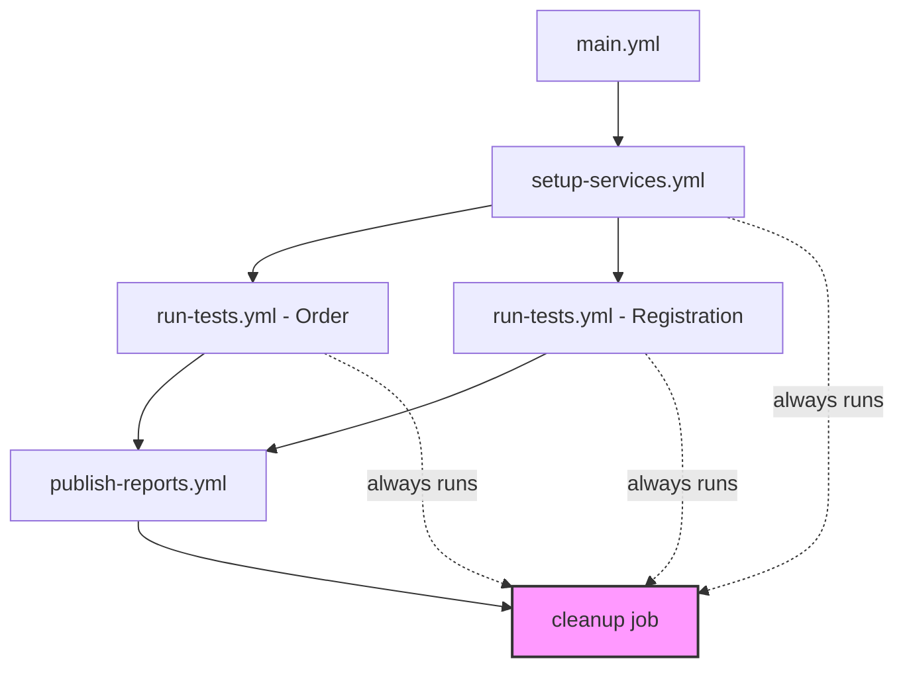

# GitHub Actions Workflows Structure

This project uses a modular GitHub Actions setup with separate workflow files for better maintainability and reusability.

## 📁 Workflow Files

### 1. **main.yml** - Main Orchestrator
**Purpose:** Entry point that orchestrates the entire CI/CD pipeline

**Triggers:**
- Push to `master` or `develop` branches
- Pull requests to `master` or `develop`
- Manual trigger via `workflow_dispatch`

**Flow:**
1. Validates services can start (calls `setup-services.yml`)
2. Runs Order tests in parallel (calls `run-tests.yml`)
3. Runs Registration tests in parallel (calls `run-tests.yml`)
4. Publishes unified test report (calls `publish-reports.yml`)
5. Cleanup and summary (always runs, even on failure)

### 2. **setup-services.yml** - Service Setup & Validation
**Purpose:** Reusable workflow to setup and verify all services

**What it does:**
- Starts MongoDB as a service container
- Clones demo application repository
- Installs and starts backend (Node.js/Express on port 3000)
- Installs and starts frontend (React/Vite on port 5173)
- Waits for all services to be healthy
- Verifies endpoints are responding
- Cleans up all services

**Output:** `services-ready` boolean indicating success

### 3. **run-tests.yml** - Test Execution
**Purpose:** Reusable workflow for running Playwright tests

**Parameters:**
- `test-suite`: Which test suite to run (`order` or `registration`)
- `browser-matrix`: JSON array of browsers to test (default: chromium, firefox, webkit)

**What it does:**
- Sets up MongoDB service container
- Clones and starts demo application
- Installs test dependencies
- Installs specified Playwright browsers
- Runs tests with specified grep pattern
- Uploads artifacts (reports, results, logs)
- Cleans up services

**Matrix Strategy:** Runs tests across all specified browsers in parallel

### 4. **publish-reports.yml** - Report Generation
**Purpose:** Reusable workflow for publishing test reports

**Parameters:**
- `report-name`: Name of the report (default: "Test Report")

**What it does:**
- Downloads all test artifacts from previous jobs
- Publishes JUnit test report
- Creates check run with detailed summary

**Permissions Required:**
- `contents: read`
- `checks: write`
- `pull-requests: write`

### 5. **cleanup-services.yml** - Cleanup & Summary
**Purpose:** Reusable workflow for final cleanup and pipeline summary

**Parameters:**
- `setup-result`: Result of setup-services job
- `test-order-result`: Result of test-order job
- `test-registration-result`: Result of test-registration job
- `publish-reports-result`: Result of publish-reports job

**What it does:**
- Displays pipeline execution summary with all job statuses
- Evaluates overall pipeline success/failure
- Confirms web services (MongoDB, Backend, Frontend) have been terminated
- Verifies all test artifacts are preserved and available
- **Does NOT delete:** Test logs, reports, results, or any artifacts

**Special Features:** 
- Uses `if: always()` to ensure it runs regardless of previous job outcomes
- Only cleans up web services, never deletes test data or artifacts
- All artifacts remain available for download from GitHub Actions

## 🔄 Workflow Dependencies



## 🎯 Benefits of This Structure

1. **Modularity:** Each workflow has a single responsibility
2. **Reusability:** Workflows can be called from other workflows or repositories
3. **Maintainability:** Easier to update individual components
4. **Testability:** Can test individual workflows in isolation
5. **Scalability:** Easy to add new test suites or modify existing ones

## 🚀 Running Workflows

### Run the full pipeline:
```bash
# Triggered automatically on push/PR, or manually:
gh workflow run main.yml
```

### Run specific test suite:
```bash
# Run only order tests
gh workflow run run-tests.yml -f test-suite=order

# Run only registration tests with specific browser
gh workflow run run-tests.yml -f test-suite=registration -f browser-matrix='["chromium"]'
```

### Run service validation only:
```bash
gh workflow run setup-services.yml
```

## 📊 Viewing Results

1. **GitHub Actions Tab:** See all workflow runs
2. **Checks Tab:** View test reports in PR checks
3. **Artifacts:** Download detailed reports from each workflow run
   - Playwright HTML reports
   - Test results (JSON/XML)
   - Allure results
   - Service logs

## 🔧 Customization

### Add a new test suite:
Edit [main.yml](.github/workflows/main.yml) and add a new job:

```yaml
test-new-suite:
  name: Run New Suite Tests
  needs: [setup-services]
  uses: ./.github/workflows/run-tests.yml
  with:
    test-suite: new-suite
    browser-matrix: '["chromium"]'
```

### Change browser matrix:
Modify the `browser-matrix` parameter in `main.yml`:

```yaml
with:
  browser-matrix: '["chromium", "firefox"]'  # Only 2 browsers
```

### Modify service setup:
Edit [setup-services.yml](.github/workflows/setup-services.yml) to change:
- MongoDB version
- Backend/Frontend ports
- Environment variables
- Wait timeouts

## 🐛 Troubleshooting

### Services fail to start:
- Check [setup-services.yml](.github/workflows/setup-services.yml) logs
- Review timeout values (currently 40 attempts × 3s = 2 minutes)
- Verify MongoDB health check is passing

### Tests fail:
- Check specific test job logs in [run-tests.yml](.github/workflows/run-tests.yml)
- Download artifacts to see detailed reports
- Review service logs in "Show service logs on failure" step

### Reports not generated:
- Ensure [publish-reports.yml](.github/workflows/publish-reports.yml) has proper permissions
- Check if test artifacts were uploaded successfully
- Verify JUnit XML files are in expected paths

## 📝 Migration Notes

The original monolithic workflow ([playwright.yml.bak](playwright.yml.bak)) has been split into these modular files. The functionality remains identical, but the structure is now more maintainable and reusable.
